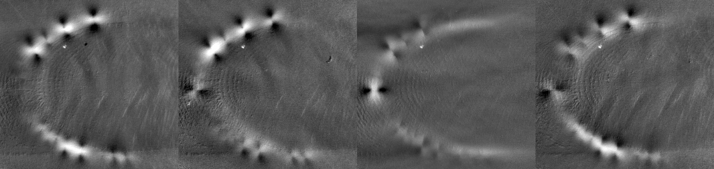
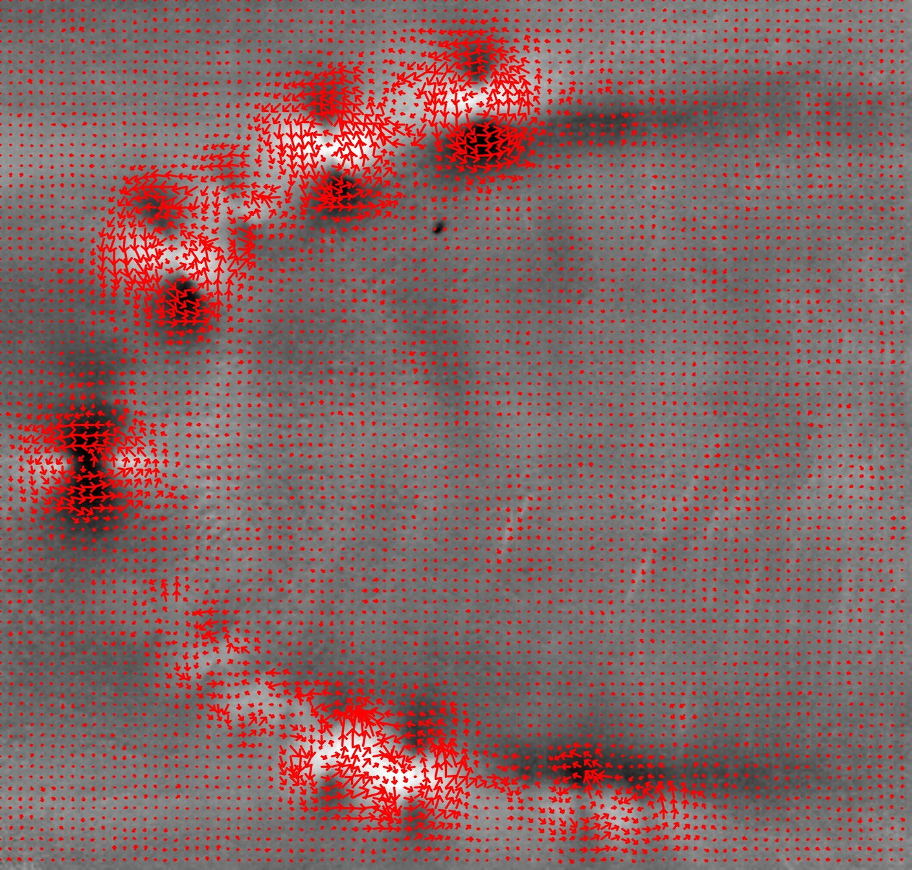
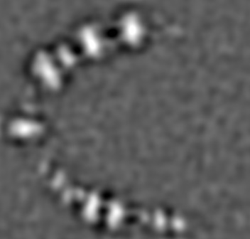
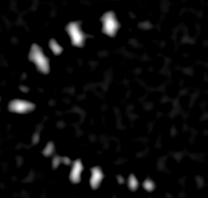

# README
Thermography functions: processing, stabilization, etc. 

| Phases |
 ---|
||

# Phase-shifted vorticity [1]

| Optical Flow|Vorticity|VorticityClamp|
| ------------- | ------------- | ------------- |
|    |    |     |

## TODO
-  IO
    - json parse
-  temporal compresions
    - HOS
    - PCA
    - PCT
    - DeltaT
    - TSR
-  stabilization
    - stitch imgs
-  others
    - detect local maxima
    - draw keypoints

## DONE
-  IO
    - read edevis containers
- temporal compresions
    - FFT
-  processing
    - phase-shifted optical flow

[1]: @article{urtasun2023phase,
    author={Urtasun, Benat and Andonegui, Imanol and Gorostegui-Colinas, Eider},
    title={Phase-shifted imaging on multi-directional induction thermography},
    journal={Scientific Reports},
    volume={13},
    number={1},
    pages={17540},
    year={2023},
    publisher={Nature Publishing Group UK London}
    }
